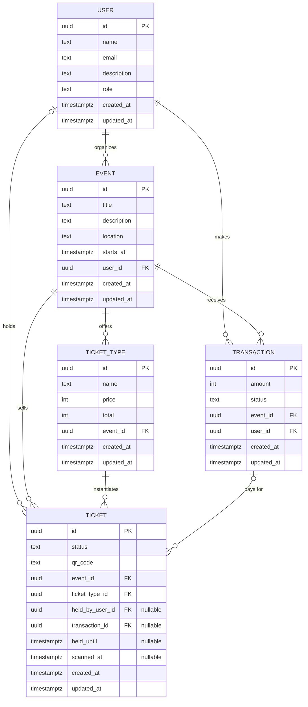

- Availability is derived by counting ticket rows, not stored as a counter, because a stored counter drifts under concurrent writes.
- Tickets are pre-created per ticket type so each one can be locked individually.
- ticket.event_id is denormalised for query speed; safe because it's immutable, unlike a counter.
- Holds expire by timestamp rather than by a background job — an expired hold is treated as available at read time.
- Money is stored as integer minor units.
