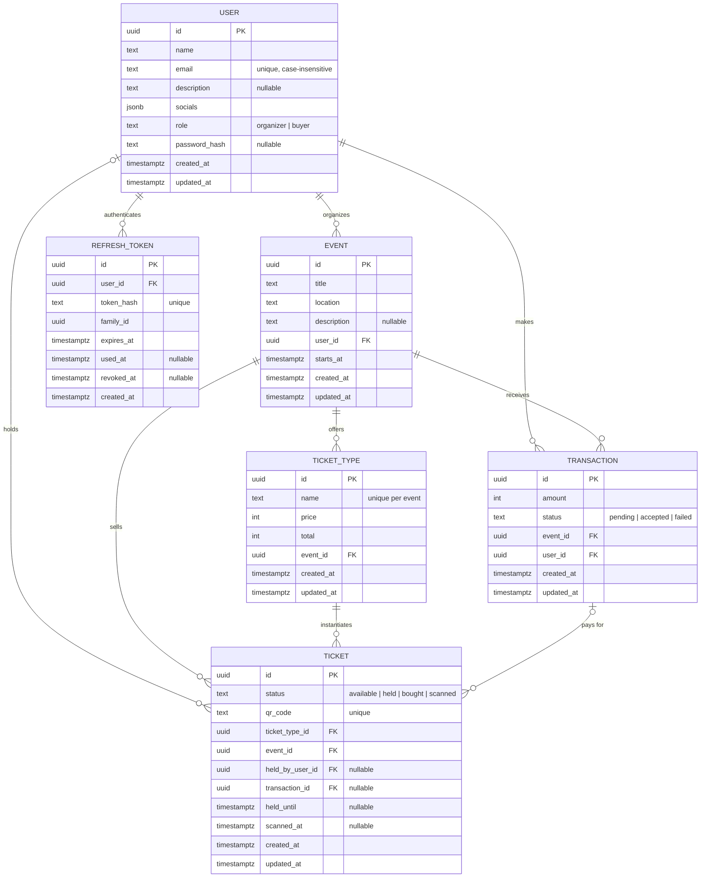

- Primary keys default to `uuidv7()` so IDs are sortable by creation time without a separate index.
- Every table except `refresh_tokens` has an `updated_at` maintained by a shared `set_updated_at()` trigger; `refresh_tokens` rows are immutable once issued, so it has no `updated_at`.
- `users.email` is enforced unique case-insensitively via `CREATE UNIQUE INDEX ON users (lower(email))`, not a column-level constraint.
- `users.password_hash` is nullable — rows created before password auth was introduced (D-024) may not have one set.
- `users.role` is constrained to `organizer` or `buyer`.
- `events.user_id`, `transactions.event_id`, and `transactions.user_id` use `ON DELETE RESTRICT`: an organizer or event can't be deleted while dependent rows exist.
- `ticket_types.event_id` uses `ON DELETE CASCADE`; deleting an event deletes its ticket types.
- `ticket_types` has a unique constraint on `(event_id, name)`.
- Availability is derived by counting ticket rows, not stored as a counter, because a stored counter drifts under concurrent writes.
- Tickets are pre-created per ticket type so each one can be locked individually.
- `ticket.event_id` is denormalised for query speed; safe because it's immutable, unlike a counter.
- `tickets` has a composite index on `(event_id, status)` to support availability/listing queries.
- Holds expire by timestamp rather than by a background job — an expired hold is treated as available at read time.
- Ticket state is enforced by three symmetric (`<=>`) check constraints, so a ticket's status and its supporting columns can never drift out of sync in either direction:
  - `status = 'held'` iff `held_until` and `held_by_user_id` are both set.
  - `status = 'scanned'` iff `scanned_at` is set.
  - `status IN ('bought', 'scanned')` iff `transaction_id` is set.
- Money is stored as integer minor units.
- `refresh_tokens` supports rotation with reuse detection: each token belongs to a `family_id` shared across its rotation chain, `used_at` marks a token as already rotated, and `revoked_at` marks a token (or, by convention, its whole family) as invalidated — e.g. when a used token is presented again.
